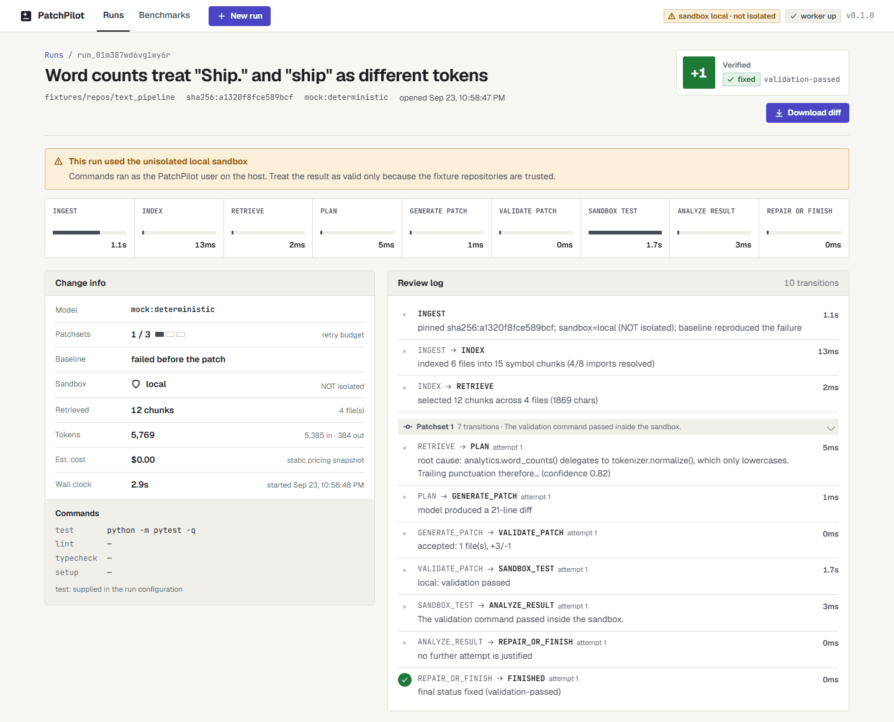
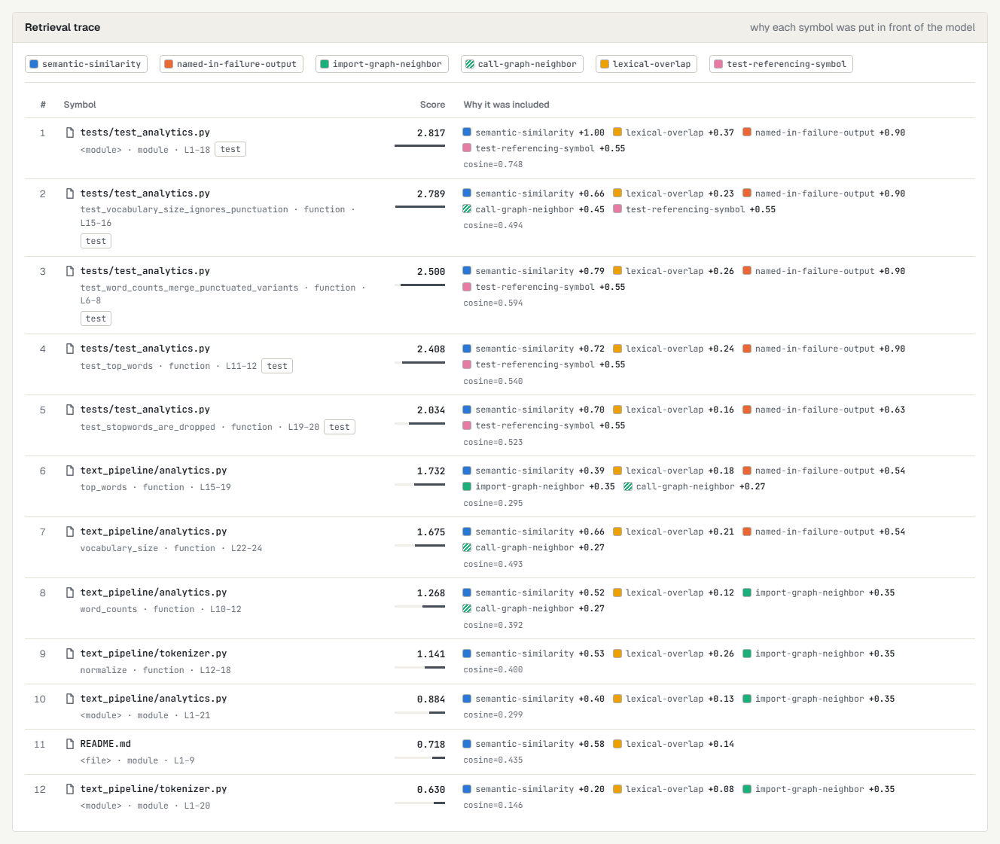
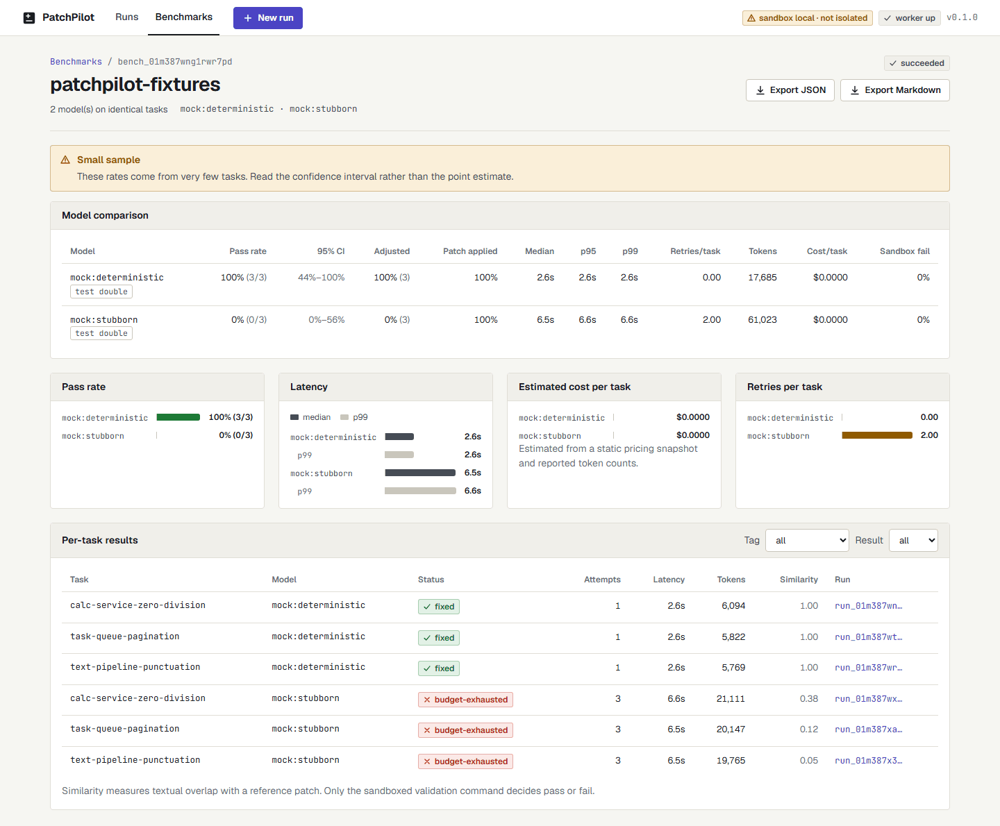

# PatchPilot

[](https://github.com/hrdk6/PatchPilot/actions/workflows/ci.yml)
[](pyproject.toml)
[](apps/web)
[](LICENSE)

**An autonomous repository-level bug-fix agent, and the evaluation platform that
tells you whether it actually works.**

**Built with** Python · FastAPI · LangGraph · SQLAlchemy + Alembic · React +
TypeScript + Vite · Docker · Qdrant · GitHub Actions

Give PatchPilot a repository and an issue. It indexes the code structurally,
retrieves the relevant symbols *with their import and call-graph neighbours*,
asks a configurable model for a plan and then a patch, runs that patch inside a
locked-down sandbox, and feeds the failures back into a bounded repair loop.
Every decision, diff, command and number is persisted and inspectable.

It also benchmarks models against each other on identical tasks, and reports the
result honestly — with confidence intervals, sample-size warnings, and a note
saying which numbers are estimates.

```
INGEST ─▶ INDEX ─▶ RETRIEVE ─▶ PLAN ─▶ GENERATE_PATCH ─▶ VALIDATE_PATCH
                       ▲                                        │
                       │                                        ▼
                       └─ REPAIR_OR_FINISH ◀─ ANALYZE_RESULT ◀─ SANDBOX_TEST
                                  │
                                  ▼
                              FINISHED
```



---

## Why this exists

Most "AI fixes your bugs" demos are a prompt and a diff viewer. The hard parts
are elsewhere:

| The hard part | What PatchPilot does about it |
| --- | --- |
| Finding the right code in a repository too large for a context window | Symbol-aligned chunking plus hybrid retrieval — semantic, lexical, import-graph, call-graph, failure-trace — where **every chunk carries the reason and weight that selected it** |
| Running code a model just wrote | Copy-not-mount workspaces, `--network none`, non-root, dropped capabilities, CPU/memory/PID/time/output limits, and a patch policy that refuses CI configs, lockfiles and path traversal |
| Knowing when to stop | A deterministic, rule-based `ANALYZE_RESULT`, a retry budget enforced in exactly one place, and early stops for unsafe or repeated patches |
| Knowing whether it works | A benchmark harness that runs identical tasks across models and reports pass rate, adjusted pass rate, latency percentiles, tokens, estimated cost and retries — with Wilson intervals and explicit caveats |

**What it does not do:** repair arbitrary software unattended. Every patch is an
artifact you review. PatchPilot never merges, pushes or opens a pull request.

---

## Run the demo (no API key, no network, ~1 minute)

**macOS / Linux**

```bash
python -m venv .venv
. .venv/bin/activate
pip install -e ".[dev]"
patchpilot demo
```

**Windows (PowerShell)** — run each line separately; Windows PowerShell 5.1 does
not accept `&&` as a statement separator:

```powershell
python -m venv .venv
.\.venv\Scripts\python.exe -m pip install -e ".[dev]"
.\.venv\Scripts\patchpilot.exe demo
```

Calling the executables inside `.venv\Scripts\` directly avoids activation
entirely, which also sidesteps PowerShell's script-execution policy blocking
`Activate.ps1`.

That ingests three bundled fixture repositories, indexes them, retrieves
context, generates patches, runs them in a sandbox and verifies the result.
Real output, from a machine with no usable Docker daemon (log lines trimmed):

```
sandbox: local (isolated=False)
  NOTE: no isolation available here; fixtures only.
queued calc-service-zero-division -> run_01m3887bae9ntmcb
queued text-pipeline-punctuation -> run_01m3887baqf9693r
queued task-queue-pagination -> run_01m3887bat1vrj26

waiting for the worker...

[PASS] calc-service-zero-division   fixed              attempts=1 sandbox=local run=run_01m3887bae9ntmcb
[PASS] text-pipeline-punctuation    fixed              attempts=1 sandbox=local run=run_01m3887baqf9693r
[PASS] task-queue-pagination        fixed              attempts=1 sandbox=local run=run_01m3887bat1vrj26
```

With a Docker daemon running, the first two lines instead read
`sandbox: docker (isolated=True)` and every command runs inside a container.

> The default model is `mock:deterministic` — a **test double** that replays a
> scripted patch, not a model doing reasoning. It exists so the entire pipeline
> is exercisable offline and in CI. Swap in a real model with `--model` once you
> have a key. The benchmark report labels mock models as test doubles everywhere
> they appear.

### The whole stack

```bash
docker compose -f infra/docker-compose.yml up --build
```

Dashboard at <http://localhost:5173>, API docs at <http://localhost:8000/docs>.

### Without Docker Compose

Two terminals:

```bash
patchpilot serve                            # API + background worker on :8000
```

```bash
cd apps/web && npm install && npm run dev   # dashboard on :5173
```

On Windows PowerShell, use `.\.venv\Scripts\patchpilot.exe serve` and run the
`cd` and `npm` steps as separate lines.

---

## What a run looks like

**1. Create a run.** Repository URL or local path, the issue text (or a GitHub
issue number), a model, and the retry budget. If the sandbox is not isolated on
your machine, the form says so before you start rather than after.

**2. Watch the state machine.** Each transition is recorded with a reason and a
duration, streamed as it happens:

```
               · -> INGEST             985ms  pinned sha256:d8de3dcf8251c925;
                                              sandbox=local (NOT isolated);
                                              baseline reproduced the failure
          INGEST -> INDEX                8ms  indexed 6 files into 22 symbol chunks
                                              (6/12 imports resolved)
           INDEX -> RETRIEVE             2ms  selected 12 chunks across 3 files (1918 chars)
        RETRIEVE -> PLAN                 5ms  root cause: paginate() documents 1-indexed
                                              pages but computes `start = page * per_page`…
  GENERATE_PATCH -> VALIDATE_PATCH       0ms  accepted: 1 file(s), +1/-1
  VALIDATE_PATCH -> SANDBOX_TEST      1847ms  local: validation passed
    SANDBOX_TEST -> ANALYZE_RESULT       3ms  The validation command passed inside the sandbox.
  ANALYZE_RESULT -> REPAIR_OR_FINISH     0ms  no further attempt is justified
REPAIR_OR_FINISH -> FINISHED             0ms  final status fixed (validation-passed)
```

**3. Inspect the retrieval trace.** Not "here is some context" — here is the
score and every reason that produced it:

| # | Symbol | Score | Why it was included |
| --- | --- | --- | --- |
| 1 | `tests/test_pagination.py::test_store_lists_first_page` | 2.749 | `semantic-similarity +0.99` `lexical-overlap +0.31` `named-in-failure-output +0.90` `test-referencing-symbol +0.55` |
| 6 | `task_queue/api.py::TaskStore.list_tasks` | 2.058 | `semantic-similarity +0.68` `lexical-overlap +0.22` `named-in-failure-output +0.54` `import-graph-neighbor +0.35` `call-graph-neighbor +0.27` |
| 9 | `task_queue/pagination.py::Page` | 1.629 | `semantic-similarity +0.63` `lexical-overlap +0.11` `named-in-failure-output +0.54` `import-graph-neighbor +0.35` |

The failing tests rank highest here because the baseline output names them —
which is correct, but it means the suspect function itself sits mid-table. The
graph signals are what pull `task_queue/pagination.py` in at all: the issue text
never names it.

The same trace in the dashboard, for the `text_pipeline` fixture, where the bug
sits one import hop away from the module the failing tests exercise:



**4. Read the evidence.** Baseline output from before the patch, the model's
structured plan, the diff, the exact commands run in the sandbox with their exit
codes and resource limits, and the token/cost/latency breakdown. Then review the
patch yourself.

### The dashboard

Three pages, all reading real persisted data:

- **New run** — repository, issue, model, budget, sandbox controls. Models you
  have not configured are listed but disabled, with the env var that would
  enable them.
- **Run detail** — each run reads like a change in a code-review tool: the issue
  as its subject, a Verified +1/−1 verdict, a stage rail showing where the time
  went (and a marked line where a failed run stopped), a live review log, the
  proposed diff with line-number gutters, one patchset per attempt with its plan
  and sandbox checks, and the retrieval trace. Pick a signal in the trace's
  legend to highlight every chunk it selected.
- **Benchmarks** — model comparison table with 95% confidence intervals, charts
  for pass rate / latency / cost / retries, filters by tag and outcome, and
  JSON + Markdown export.



The dashboard follows the system light/dark preference and reflows down to phone
width. Its visual system (tokens, colour rules, components) is documented in
[`DESIGN.md`](DESIGN.md).

---

## Benchmarking

```bash
# The harness against itself, offline.
patchpilot bench patchpilot-fixtures -m mock:deterministic -m mock:stubborn

# A hosted model against a local one, on identical tasks.
export PATCHPILOT_OPENAI_API_KEY=sk-...
patchpilot bench patchpilot-fixtures -m openai:gpt-4o-mini -m ollama:qwen2.5-coder
```

Real output from `mock:deterministic` (replays the reference fix) versus
`mock:stubborn` (patches that apply but never fix), with `openai:gpt-4o`
requested but not configured (the Markdown report, some columns omitted):

```
## Skipped models
- `openai:gpt-4o`: no OpenAI API key configured

| Model | Pass rate | 95% CI | Adjusted | Patch applied | Median | Retries/task | Tokens | Est. cost |
| --- | --- | --- | --- | --- | --- | --- | --- | --- |
| `mock:deterministic *(test double)*` | 100% (3/3) | 44% to 100% | 100% (3 confirmed) | 100% | 2.8s | 0.00 | 17,685 | $0.00 |
| `mock:stubborn *(test double)*`      |   0% (0/3) |  0% to 56%  |   0% (3 confirmed) | 100% | 7.0s | 2.00 | 61,028 | $0.00 |

## How to read this
- **Small sample.** 2 model(s) were evaluated on 3 task(s), below the 10-task
  threshold at which these rates start to mean much. Read the confidence
  interval, not the point estimate: a 3-for-3 result is consistent with a true
  pass rate near 40%.
- **Test doubles included.** Models prefixed `mock:` replay a scripted patch…
```

Three tasks is not a benchmark of model capability, and the report says so.
`docs/evaluation.md` defines every metric and what it does and does not prove.

---

## Architecture

```
apps/web        React + TypeScript + Vite dashboard
apps/api        FastAPI, SQLAlchemy, Alembic, database-backed worker, CLI
packages/core   domain models, Protocol interfaces, config, logging, diff engine
packages/indexer  scanner, Python AST parser, dependency graph, embeddings,
                  vector store, hybrid retrieval
packages/agent    ingest, prompts, structured output, patch policy,
                  LangGraph state machine, model adapters
packages/sandbox  disposable workspaces, hardened Docker sandbox, local fallback
packages/evals    datasets, benchmark runner, metrics, reports
fixtures          three broken Python repositories + datasets + scripted solutions
```

`packages/core` defines the models and the `Protocol` interfaces. Every other
package depends on core and on nothing else inside PatchPilot — the agent
depends on the *shape* of a sandbox, not on `patchpilot_sandbox`. That is what
makes the extension points real:

| To add | Implement | Register |
| --- | --- | --- |
| TypeScript support | `CodeParser` | `register_parser(TypeScriptParser())` |
| A remote sandbox (E2B, Firecracker) | `Sandbox` (2 methods) | `PATCHPILOT_SANDBOX_BACKEND=e2b` |
| Another model provider | `LLMAdapter` | a branch in `build_adapter` |
| A different vector store | `VectorStore` | `build_vector_store` |

Full detail in [`docs/architecture.md`](docs/architecture.md).

### Notable implementation choices

- **Symbol-aligned chunks, not token windows.** The unit of retrieval is a
  function, method, class header or module preamble with decorators, signature
  and docstring intact — something a model can actually patch.
- **A pure-Python diff applier.** PatchPilot does not shell out to `git apply`.
  Doing so would run a binary over attacker-influenced input on the host
  *before* the sandbox exists. Application is all-or-nothing.
- **`ANALYZE_RESULT` is rule-based.** Whether to spend another attempt is a
  budget decision. Making it a model call would make runs unreproducible and let
  a model talk itself into an unbounded loop.
- **The mock adapters are honest test doubles.** They replay scripted edits from
  `fixtures/solutions/` — which live *outside* the fixture repositories, so
  nothing inside a repo under test tells a model where the bug is.

---

## Security

PatchPilot downloads code it did not write, asks a model to modify it, and
executes the result. [`docs/security.md`](docs/security.md) states the threat
model, the controls and the limits without hedging. The short version:

- The repository is **copied** into the sandbox, never bind-mounted. No host
  path is visible to the container. Each attempt gets a fresh workspace.
- `--network none`, non-root user, `--cap-drop ALL`, `no-new-privileges`, and
  memory / swap / CPU / PID / tmpfs / wall-clock limits.
- A patch policy that refuses CI configs, lockfiles, Docker files, dotfiles,
  secrets, path traversal and oversized diffs — and **ends the run immediately**
  on a violation rather than spending a retry.
- Sandbox output is ANSI-stripped, path-masked, secret-redacted and truncated
  before it is stored, logged or put back in a prompt.

**Honest limits:** Docker is kernel-shared isolation; a container escape defeats
all of it. Disk is not bounded on storage drivers without `--storage-opt`. The
API has no authentication — bind it to localhost. Redaction is pattern matching,
not a guarantee. `docs/security.md` lists all of them and the hardening roadmap.

### The local sandbox

When Docker is unavailable, PatchPilot can fall back to running commands as your
user with **no isolation at all**. This exists so CI and contributors can
exercise the pipeline against the trusted fixture repositories. It is refused in
production, can be disabled outright, and every run, every UI page and every
benchmark report records whether the sandbox was actually isolated.

---

## Configuration

Everything is environment-driven with working defaults — copy
[`.env.example`](.env.example) and edit, or run with nothing set at all. **No
cloud account, API key or proprietary service is required.**

| Variable | Default | Notes |
| --- | --- | --- |
| `PATCHPILOT_DEFAULT_MODEL` | `mock:deterministic` | `provider:model`; `openai:`, `anthropic:`, `ollama:`, `openai-compat:` |
| `PATCHPILOT_EMBEDDING_PROVIDER` | `hash` | Local, deterministic, free. `openai` for any OpenAI-compatible endpoint |
| `PATCHPILOT_QDRANT_URL` | unset | Unset uses the on-disk local vector store |
| `PATCHPILOT_DATABASE_URL` | SQLite | PostgreSQL-compatible; no dialect-specific types |
| `PATCHPILOT_SANDBOX_BACKEND` | `auto` | `auto` prefers Docker; `local` has no isolation |
| `PATCHPILOT_MAX_REPAIR_ATTEMPTS` | `3` | Hard cap on the repair loop |
| `PATCHPILOT_GITHUB_TOKEN` | unset | Optional; pasting issue text always works |
| `PATCHPILOT_CORS_ORIGINS` | `http://localhost:5173` | Dashboard origins; comma-separated or a JSON list |

The same `PATCHPILOT_OPENAI_BASE_URL` adapter drives OpenAI, Ollama, vLLM, LM Studio and
any gateway speaking that format — so a benchmark can compare a frontier model
against one running on the machine under the desk.

---

## CLI

```bash
patchpilot demo                      # offline end-to-end demo
patchpilot serve                     # API + worker
patchpilot run <repo> --issue "..."  # one run, prints the timeline and the diff
patchpilot index <repo>              # index only; --show-symbols to list them
patchpilot bench <dataset> -m <model> [-m <model>]
patchpilot sandbox                   # which backend, and the controls it applies
patchpilot db upgrade|downgrade|current
```

---

## Development

```bash
pip install -e ".[dev]"
pre-commit install

ruff check .                            # lint
ruff format --check .                   # format
mypy packages apps/api                  # type check
pytest -q                               # 391 tests; 4 need a Docker daemon
```

```bash
cd apps/web
npm install
npm run lint
npm run test                            # 30 tests
npm run build
```

Each command is on its own line so the block pastes into PowerShell as well as
bash. On Windows, prefix the Python tools with `.\.venv\Scripts\` (for example
`.\.venv\Scripts\python.exe -m pytest -q`) rather than activating the venv.

Tests never touch the network or a real model: the deterministic mock adapters,
the local hash embedder and the in-process vector store cover every path. Docker
sandbox tests skip automatically when no daemon is reachable, and the hardening
flags they assert are *also* asserted statically so the security posture stays
covered either way.

CI runs backend lint/types/tests, frontend lint/types/tests/build, a migration
up-and-down round trip, the offline demo, a two-model benchmark, both container
builds, the Docker sandbox tests against a real daemon, and a boot of the full
`docker compose` stack checked end to end through the dashboard's API proxy.

---

## Project status and limitations

This is a working vertical slice, not a product. Stated plainly:

- **Python only.** The parser registry and `CodeParser` protocol are built for
  more, but only Python is implemented and tested.
- **Small-to-medium repositories with existing tests.** A repository with no
  test command is refused, with a reason. The validation command is the entire
  definition of success.
- **Passing tests ≠ correct.** A patch that satisfies the suite can still be
  wrong. That gap is the most interesting unmeasured number in this project, and
  measuring it is on the roadmap.
- **The bundled benchmark is three tasks.** It is a regression test for the
  harness, not evidence about model capability.
- **No dependency installation by default.** The sandbox has no network, so
  repositories needing `pip install` need an explicit setup command and
  `network=bridge`.
- **Single-node.** The worker is threads over a database queue. It is safe for
  several processes but is not a distributed scheduler.

[`docs/roadmap.md`](docs/roadmap.md) covers what comes next — GitHub PR
validation, remote sandboxes, TypeScript, a policy engine, enterprise CI — and
what is deliberately excluded (auto-merge, multi-agent decomposition).

## Documentation

| Document | What is in it |
| --- | --- |
| [`docs/architecture.md`](docs/architecture.md) | Components, data flow, state machine, terminal states, why the boundaries fall where they do |
| [`docs/security.md`](docs/security.md) | Threat model, every control, every known limit, hardening roadmap |
| [`docs/evaluation.md`](docs/evaluation.md) | Every metric defined, what each proves, reproducibility, how to add tasks |
| [`docs/roadmap.md`](docs/roadmap.md) | What is next and what is excluded on purpose |
| [`DESIGN.md`](DESIGN.md) | The dashboard's visual system: tokens, colour rules, components |

## License

MIT — see [LICENSE](LICENSE).
